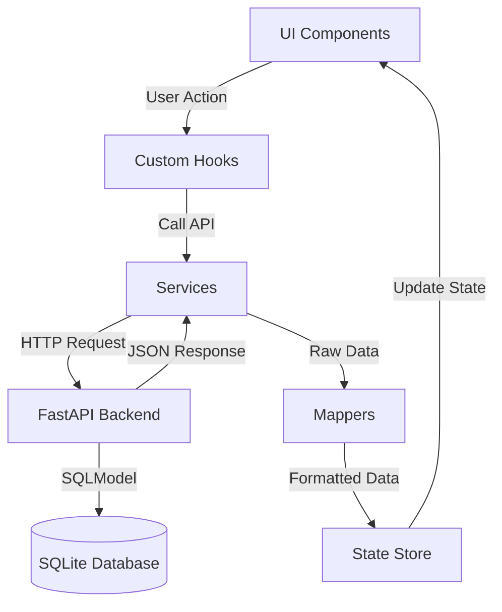

# House Defect MVP Architecture

This document describes the high-level architecture, design patterns, and data flow of the House Defect Image Captioning web application.

## 1. Overview
The application is a **Client-Side SPA (Single Page Application)** built with **Vite + React**. It is designed as a **PWA (Progressive Web App)** to support mobile usage (Camera access, installability).

The core function is to analyze house defect images using an AI model (currently mocked) and display results in a minimalist dashboard.

## 2. Technology Stack
- **Framework:** React 19 + TypeScript
- **Build Tool:** Vite 6
- **Styling:** Tailwind CSS 4.0
- **State Management:** Zustand
- **Icons:** Lucide React
- **PWA:** vite-plugin-pwa
- **Backend:** FastAPI + Python 3.12
- **Database:** SQLite + SQLModel (ORM)

## 3. Layered Architecture
The project follows a strict **Layered Architecture** to ensure separation of concerns and scalability.



### Layer Responsibilities

| Layer | Path | Responsibility | Example |
| :--- | :--- | :--- | :--- |
| **Types** | `src/types/` | Define data contracts and interfaces. Shared across all layers. | `DefectAnalysisUI`, `InferenceResponseDB` |
| **Services** | `src/services/` | Handle external API calls or AI inference. **Mock-First approach**. | `captioningService.ts` (simulates AI delay) |
| **Backend** | `backend/` | Python FastAPI server handling AI inference and DB operations. | `app.py`, `engine.py` |
| **Database** | `backend/database.db` | SQLite database storing defect analysis history. | `models.py` (DefectRecord) |
| **Store** | `src/lib/store.ts` | Manage global application state using Zustand. | `useStore` (analyses, stats) |
| **Mappers** | `src/lib/mappers/` | Transform raw API data into UI-friendly formats (e.g., translate labels). | `defectMapper.ts` (wall_crack -> รอยร้าว) |
| **Logic (Hooks)** | `src/hooks/` | Encapsulate business logic and connect UI to Store/Services. | `useDefectAnalysis.ts` |
| **UI** | `src/components/` | Presentational components. minimal logic, focused on rendering. | `Dashboard.tsx`, `UploadZone.tsx` |

## 4. Key Workflows

### Image Analysis Flow
1.  **User** uploads an image via `UploadZone.tsx`.
2.  `Dashboard.tsx` calls `analyzeImage` from `useDefectAnalysis` hook.
3.  **Hook** sets `isAnalyzing = true`.
4.  **Hook** calls `captioningService.analyze(image)`.
5.  **Service** waits (mock delay) and returns raw `InferenceResponseDB`.
6.  **Hook** passes raw data to `defectMapper.toUI`.
7.  **Mapper** converts raw data to `DefectAnalysisUI` (adds Thai labels, formats dates).
8.  **Hook** calls `store.addAnalysis(result)`.
9.  **Store** updates `analyses` array and recalculates `stats`.
10. **UI** automatically re-renders with new data via Zustand selector.

## 5. Design Decisions

*   **PWA-First:** Configured in `vite.config.ts` to allow local network access (`host: true`) and camera usage on mobile.
*   **Tailwind 4.0:** Uses the new `@import "tailwindcss";` and `@theme` syntax for better performance and smaller bundle size.
*   **Separation of AI Logic:** The AI model is treated as an external service. In the future, `captioningService.ts` can be swapped to call a real Python backend or ONNX Runtime without changing the UI.
*   **Database Persistence:** SQLite is chosen for simplicity and portability. Data is accessed via REST API (`/defects`), keeping the frontend decoupled from the DB specific implementation.

## 6. Database Schema
The application uses **SQLModel** to define the schema. The main entity is `DefectRecord`:

| Field | Type | Description |
| :--- | :--- | :--- |
| `id` | `int` | Primary Key |
| `filename` | `str` | Original filename |
| `caption` | `str` | AI generated caption |
| `label` | `str` | Defect category (e.g., wall_crack) |
| `confidence` | `float` | AI confidence score (0.0 - 1.0) |
| `image_path` | `str` | Path to stored image (relative to `outputs/`) |
| `timestamp` | `datetime` | Creation time |

## 7. Directory Structure
```
src/
├── components/       # React Components (UI)
├── hooks/            # Custom React Hooks (Logic)
├── lib/
│   ├── mappers/      # Data transformation functions
│   └── store.ts      # Global State (Zustand)
├── services/         # API / AI Service layers
├── types/            # TypeScript Interfaces
├── App.tsx           # Root Component
└── main.tsx          # Entry Point
```
